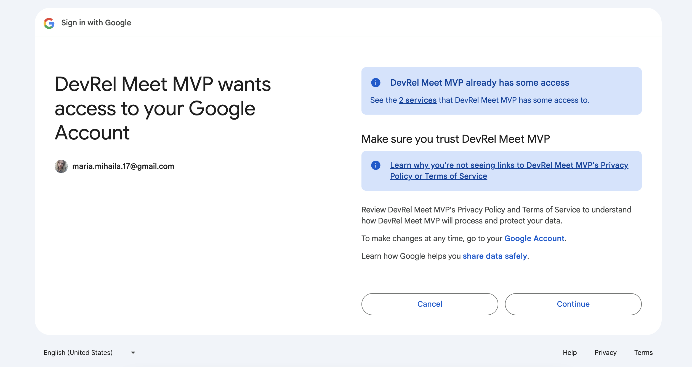
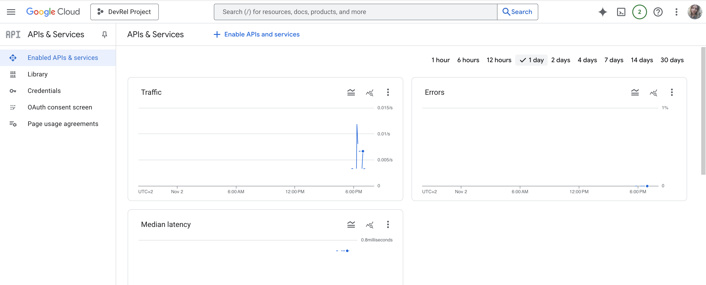
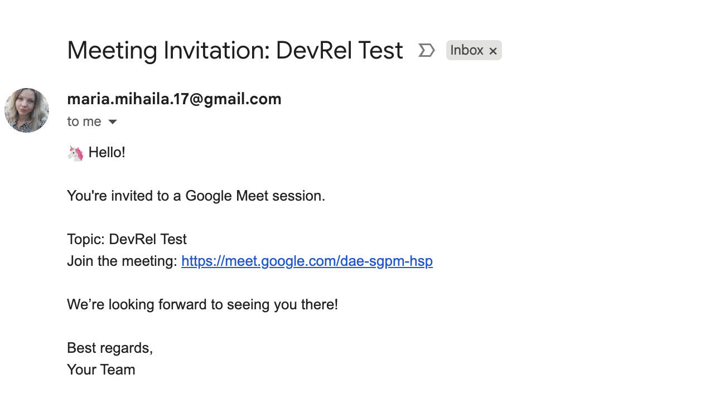

# Dev Diary: Google Meet Link Generator

## Setup Exploration & Key Decisions

### Why NestJS?
**Decision**: Use NestJS framework instead of plain Express.js

**Rationale**:
- **Modularity**: NestJS encourages modular architecture with clear separation of concerns through modules, services, and controllers
- **Service Segregation**: Built-in dependency injection makes it easy to separate business logic (services) from request handling (controllers)
- **Type-Safe Development**: Native TypeScript support with decorators for better clarity in architecture
- **Scalability**: Well-structured foundation that scales well as the application grows
- **Best Practices**: Opinionated framework that enforces patterns like dependency injection, making code more maintainable and testable. It can also have Guards for authentication and built in validation for checking input - for this MVP it was not implemented as I only wanted to focus on basic functionality.

**Alternative Considered**: Plain Express.js
**Why Not**: While simpler initially, Express would require more manual setup for dependency injection, testing, and maintaining clean architecture as complexity grows.

### Why Google APIs Node.js Client for Meet SDK?
**Decision**: Use `googleapis` (Google APIs Node.js Client Library) instead of a standalone Meet SDK

**Reasoning**: This is the officially supported method for creating Google meetings. When official documentation provides clear guidelines and ongoing support, it is generally the best choice.

**Alternatives Considered**:
- Standalone Meet SDK: Doesn't exist; Meet links are part of Calendar events
- Google Calendar REST API directly: Would require manual OAuth2 implementation and request handling
- Other third-party libraries: Less official support and may not stay current with API changes

### Architecture Breakdown Consideration - Overview: Two-Part Logic
The application logic is divided into two distinct parts:

#### 1. Authentication Flow
- **Purpose**: Handle OAuth2 authentication with Google
- **Methods**: 
  - `getSessionToken()` - Generates OAuth2 authorization URL and opens browser. This will automatically happen thanks to the open library and you will land on a step similar to the one illustrated below after choosing your google account.


  - `getTokenFromCode()` - Exchanges authorization code for access/refresh tokens
- **Endpoints**:
  - `GET /auth/google/refresh-token` - Initiates authentication
  - `GET /auth/google` - Handles OAuth callback

#### 2. Meeting Generation Flow
- **Purpose**: Create calendar events with Google Meet links
- **Methods**:
  - `createMeetingEvent()` - Creates calendar event with Meet conference data
- **Endpoints**:
  - `POST /` - Creates the meeting and returns Meet link


#### Getting Google OAuth Credentials ⚠️

**Note**: The biggest stressor in this implementation is getting the credentials you need. As such, here is a detailed overview of how to achieve that.

### Approach
Getting credentials for using your personal email as a bot. An alternative was to have Google Workspace (organization) account in order to provide Domain-Wide Delegations access; however, I used a simple email in order to achieve this MVP as I did not have access to an organization workspace. You can find additional information on the Domain Wide Delegation Access here: https://developers.google.com/identity/protocols/oauth2/service-account#delegatingauthority.

### Step-by-Step Guide

1. **Create a Google Cloud Project**
   - Go to https://console.cloud.google.com/
   - Click "Select a project" → "New Project"
   - Give your project a name and create it

2. **Enable Google Calendar API**
   - In the project dashboard, go to "APIs & Services" → "Library"
   - Search for "Google Calendar API"
   - Click "Enable"

3. **Create OAuth 2.0 Credentials**
   - Go to "APIs & Services" → "Credentials"
   - Click "Create Credentials" → "OAuth client ID"
   - Cconfigure the OAuth consent screen:
     - Choose "External" user type
     - Fill in app name, user support email
   - Create OAuth Client ID:
     - Application type: "Web application"
     - Name: Your app name
     - **Authorized redirect URIs**: `http://localhost:3010/auth/google`
   
4. **Save Your Credentials**
   - Copy the Client ID, Client Secret and Google redirect URI
   - Add them to your `.env` file

5. **Add Yourself as Test User**
   - Go to "APIs & Services" → "OAuth consent screen"
   - Click on "Test users" section
   - Click "Add users"
   - Enter your Gmail address
   - Click "Add"
   - ⚠️ **This is critical**: For the testing phase, you MUST add yourself as a test user in the OAuth consent screen, otherwise authentication will fail with "access_denied"

### Critical Implementation Notes

⚠️ **Important**: The Calendar API callback expects your redirect URI to be implemented in your controller. You need to create this endpoint in your app to finalize the Google OAuth callback (it does this automatically, but you need to add the logic for adding the refresh_token and access_token to your oAuth2Client instance in order to further create calendar events).

**My redirect URI**: `http://localhost:3010/auth/google`

Once the endpoint was implemented and I added the logic for the refresh_token and access_token, the implementation went smoothly.

**Setup of generateAuthUrl considerations**:
- By using `generateAuthUrl()` with `access_type: 'offline'`, we get a refresh token. This is very important for the development phases. In addition to this, I also added the `prompt: 'consent'` parameter which ensures the refresh token is always returned (important for subsequent requests).

**OAuth Scopes - Important Considerations**:
- The `scope` parameter in `generateAuthUrl()` defines what permissions your app needs. For this project, we use: `'https://www.googleapis.com/auth/calendar'` because it allows the app to create, read, update, and delete calendar events.
⚠️ **Critical**: All required scopes must be requested during initial authentication
- For this MVP, we only request Calendar permissions, which is sufficient for generating Meet links through calendar events 

6. **Installed `open` Package for Automatic Window Opening**
- To avoid the tedious process of copying and pasting URLs from the debug console, I added the open package to automatically redirect to the authentication browser. This simplifies the workflow and would also benefit a frontend implementation. I chose the `open` library because it is widely used, actively maintained, and has over 50 million weekly downloads, indicating that it is both reliable and robust

7. **Interesting metrics to consider and monitor**
- In your app dashboard, you will find something similar to the below image. It is a powerful monitoring tool worth exploring.



8. **Implemented Improvement: Sending email to recipients**
- A good improvement is to enable Gmail API integration to automatically send Meet link invitations to attendees
- **Gmail Scope**: `https://www.googleapis.com/auth/gmail.send` – This scope is required during the initial OAuth instantiation. The access and refresh tokens inherit permissions based on the requested scopes, so I added it to the SCOPE variable to enable sending emails through Gmail.
- ⚠️ **IMPORTANT**: Because we have previously set up the OAuth client credentials, we no longer need to add other credentials as they are available per project. However, we have to **Enable Gmail API** as we do not have it enabled by default. Go to Project page → APIs & Services → Enable APIs → Search "Gmail API" → Enable.
- The only step left is to add the email sending logic and the email body. I added a separate `emailTemplate` file for better readability and highly recommend it in case you want to switch between templates and have modular extensible best coding practices. And below you can see the final result:



### Environment Variables Required
```env
GOOGLE_CLIENT_ID=your_client_id_from_console
GOOGLE_CLIENT_SECRET=your_client_secret_from_console
GOOGLE_REDIRECT_URI=http://localhost:3010/auth/google
GOOGLE_REFRESH_TOKEN=''
GOOGLE_ACCESS_TOKEN=''
```

## Useful Resources

### Google APIs Node.js Client Library - useful for implementation
- **Official Documentation**: [google-api-nodejs-client](https://github.com/googleapis/google-api-nodejs-client?tab=readme-ov-file#oauth2-client)
- **Google Calendar API**: https://developers.google.com/calendar
- **Google Cloud Console**: https://console.cloud.google.com/
- **Google Domain Delegation Authority**: https://developers.google.com/identity/protocols/oauth2/service-account#delegatingauthority


